# AWS VPC routed CNI and Amazon EKS Cluster Networking

## Objective:

* Exam major components of AWS VPC routed CNI and demonstrate how it handles traffic for:
	* Pod to Pod communication
	* Pod to Service communication
* Exam the communication channels between Amazon EKS Kubernetes Control Plane and Customer worker nodes.

## Overview of the Workshop
* Perform intra-node Pod to Pod communication and exam the major components involved in the life of a ping packet
* Perform inter-node Pod to Pod communication and exam the major components involved in the life of a ping packet
* Exam the IPtable for kubernete services

## Workshop setup:

### Create Amazon EKS cluster using [AWS CloudFormation Template](https://aws.amazon.com/cloudformation/):

- **For this workshop activity, we are using AWS CloudFormation template to configure workshop setup.**
- You should have launched the AWS CloudFormation template at the beginning of the workshop session and your cluster should be already up and running
- If you did not launch the AWS CloudFormation template or template did not launch successfully, you can re-launch AWS CloudFormation template from link below.
  - [AWS CloudFormation Template: NET410 Workshop Setup](https://console.aws.amazon.com/cloudformation/home?region=eu-west-1#/stacks/new?templateURL=https://s3-eu-west-1.amazonaws.com/net410-workshop-eu-west-1/net410-workshop-setup.json)
  - **Verify you are launching it in eu-west-1 (Ireland) region**:

## Before we begin:

### Access net410-workshop-eks-mgmt instance

- Click on [Amazon EC2 Console](https://eu-west-1.console.aws.amazon.com/ec2/v2/home?region=eu-west-1#Instances:search=net410-workshop-eks-mgmt;sort=tag:Naeks-mgmt)
to retrieve net410-workshop-eks-mgmt's public ip and ssh in to the instance
```
ssh -i <key-name>  ec2-user@ec2-xx-xx-xx-xx.eu-west-1.compute.amazonaws.com
```

### Clone github:

- Clone reinvent2018-NET410 github repository in $HOME directory:
```
git clone https://github.com/liwenwu-amazon/reinvent2018-NET410
```
```
[ec2-user@ip-172-31-9-36 ~]$ git clone https://github.com/liwenwu-amazon/reinvent2018-NET410
Cloning into 'reinvent2018-NET410'...
remote: Enumerating objects: 102, done.
remote: Counting objects: 100% (102/102), done.
remote: Compressing objects: 100% (80/80), done.
remote: Total 102 (delta 34), reused 71 (delta 17), pack-reused 0
Receiving objects: 100% (102/102), 750.58 KiB | 2.34 MiB/s, done.
Resolving deltas: 100% (34/34), done.
[ec2-user@ip-172-31-9-36 ~]$
[ec2-user@ip-172-31-9-36 ~]$ cd reinvent2018-NET410/
```

## NET410 workshop activity: Amazon EKS cluster

## Amazon EKS Cluster

### Cluster Information

- Cluster that was created using [AWS CloudFormation](https://aws.amazon.com/cloudformation/) consists of 1 master node and 2 worker nodes.

#### aws eks list-clusters
```
[ec2-user@ip-172-31-9-36 reinvent2018-NET410]$ aws eks list-clusters
{
    "clusters": [
        "net410-eks-cluster"
    ]
}
```

#### aws eks describe-cluster --name net410-eks-cluster

```
[ec2-user@ip-172-31-9-36 reinvent2018-NET410]$ aws eks describe-cluster --name net410-eks-cluster
{
    "cluster": {
        "status": "ACTIVE",
        "endpoint": "https://C23A88F2572AAF0B1AEA36CD119D0682.yl4.eu-west-1.eks.amazonaws.com",
        "name": "net410-eks-cluster",
        "certificateAuthority": {
            "data": "......   "
        },
        "roleArn": "arn:aws:iam::694065802095:role/eksctl-net410-eks-cluster-cluster-ServiceRole-JQP22M9HN457",
        "resourcesVpcConfig": {
            "subnetIds": [
                "subnet-03570d333db01c922",
                "subnet-02b0202c2159049f3",
                "subnet-04dfca08b2fc54441",
                "subnet-0ff53ecf4d71f5a60",
                "subnet-09d6c50e781c0e074",
                "subnet-01b4a2c179e95f519"
            ],
            "vpcId": "vpc-09c7c672286bf7e94",
            "securityGroupIds": [
                "sg-062a376f3d16fe673"
            ]
        },
        "version": "1.10",
        "arn": "arn:aws:eks:eu-west-1:xxxxx:cluster/net410-eks-cluster",
        "createdAt": 1542590239.656
    }
}
```

#### Kubernetes Cluster Info

```
[ec2-user@ip-172-31-9-36 reinvent2018-NET410]$ kubectl cluster-info
Kubernetes master is running at https://C23A88F2572AAF0B1AEA36CD119D0682.yl4.eu-west-1.eks.amazonaws.com

To further debug and diagnose cluster problems, use 'kubectl cluster-info dump'.
```

```
[ec2-user@ip-172-31-9-36 reinvent2018-NET410]$ kubectl get node -o wide
NAME                                           STATUS   ROLES    AGE   VERSION   EXTERNAL-IP   OS-IMAGE         KERNEL-VERSION               CONTAINER-RUNTIME
ip-192-168-4-93.eu-west-1.compute.internal     Ready    <none>   15h   v1.10.3   <none>        Amazon Linux 2   4.14.72-73.55.amzn2.x86_64   docker://17.6.2
ip-192-168-77-144.eu-west-1.compute.internal   Ready    <none>   15h   v1.10.3   <none>        Amazon Linux 2   4.14.72-73.55.amzn2.x86_64   docker://17.6.2
```

### Amazon EKS Architecture

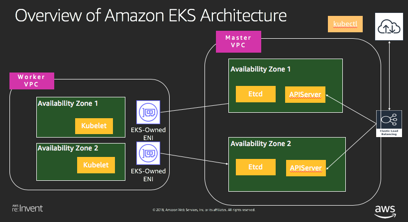

### Communication between EKS Master and Pods (e.g. kube-dns)

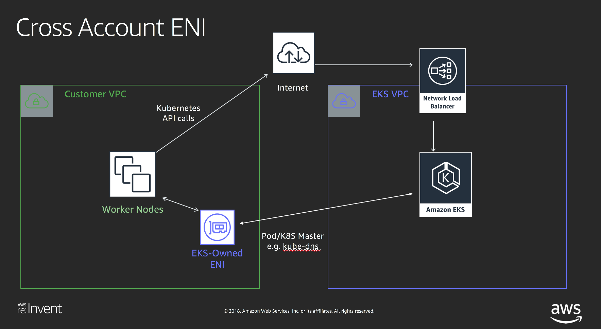

* kubectl logs/exec uses this channel (EKS Master -> Pods)
* Pods (e.g. kube-dns, aws-cni) use this channel to Read/Write/Watch Kubernetes API objects

#### Cross Account ENI

* You can find out the Cross Account ENIs in EC2 console, network interfaces, where its `Description` is `"Amazon EKS net410-eks-cluster"`

```
[ec2-user@ip-172-31-9-36 reinvent2018-NET410]$ aws ec2 describe-network-interfaces --network-interface-ids eni-0f96810f42e4f53e8 --region eu-west-1
{
    "NetworkInterfaces": [
        {
            "Attachment": {
                "AttachTime": "2018-11-19T01:27:39.000Z",
                "AttachmentId": "eni-attach-0b3be060aa470e238",
                "DeleteOnTermination": true,
                "DeviceIndex": 1,
                "InstanceOwnerId": "298800981437",
                "Status": "attached"
            },
            "AvailabilityZone": "eu-west-1a",
            "Description": "Amazon EKS net410-eks-cluster", <-- !! Cross Account ENI
            "Groups": [
                {
                    "GroupName": "eksctl-net410-eks-cluster-cluster-ControlPlaneSecurityGroup-XLHWMBXCDLTP",
                    "GroupId": "sg-062a376f3d16fe673"
                }
            ],
            "InterfaceType": "interface",
            "Ipv6Addresses": [],
            "MacAddress": "0a:d5:79:a1:af:50",
            "NetworkInterfaceId": "eni-0f96810f42e4f53e8",
            "OwnerId": "xxxx",
            "PrivateDnsName": "ip-192-168-154-135.eu-west-1.compute.internal",
            "PrivateIpAddress": "192.168.154.135",
            "PrivateIpAddresses": [
                {
                    "Primary": true,
                    "PrivateDnsName": "ip-192-168-154-135.eu-west-1.compute.internal",
                    "PrivateIpAddress": "192.168.154.135"
                }
            ],
            "RequesterId": "AROAIORXPPLFOF7XU4KUQ:AmazonEKS",
            "RequesterManaged": false,
            "SourceDestCheck": true,
            "Status": "in-use",
            "SubnetId": "subnet-09d6c50e781c0e074",
            "TagSet": [],
            "VpcId": "vpc-09c7c672286bf7e94"
        }
    ]
}
```
##### Troubleshooting Tips

* Misconfigured control plane security group
	* Control plane security group is assigned to ENIs created in the worker node subnets.
	* When launching worker nodes, control plane security group is configured to receive packets from worker nodes.
	* if different control plane security group is specified while creating worker nodes, pods will not be able to communicate with master
* VPC related issues
	* Deleting subnets in your VPC
	* Removing Ingress and Egress required for Master and Worker node communication.
	* Reaching ENI limits for an AWS Account.
	* Exhausting IPs available for Cross ENI

* Incorrect permissions on the role could stop AmazonEKS from managing Kubernetes clusters.
	* Use Managed policy provided by EKS.
	* Avoid attaching deny permissions on APIs required by AmzonEKS for managing ENIs in your VPC.


## AWS VPC Routed CNI

[https://github.com/aws/amazon-vpc-cni-k8s](https://github.com/aws/amazon-vpc-cni-k8s)

### Create Pods

```
[ec2-user@ip-172-31-9-36 reinvent2018-NET410]$ kubectl apply -f eks-cni-demo/worker_hello.yaml
```

### Show Pods

```
[ec2-user@ip-172-31-9-36 reinvent2018-NET410]$ kubectl get pod -o wide
NAME                            READY   STATUS    RESTARTS   AGE   IP               NODE
worker-hello-5d9b798f74-2gnkc   1/1     Running   0          1m    192.168.7.62     ip-192-168-4-93.eu-west-1.compute.internal
worker-hello-5d9b798f74-bjmq4   1/1     Running   0          1m    192.168.66.62    ip-192-168-77-144.eu-west-1.compute.internal
worker-hello-5d9b798f74-dmlbt   1/1     Running   0          1m    192.168.79.49    ip-192-168-77-144.eu-west-1.compute.internal
worker-hello-5d9b798f74-gfdwn   1/1     Running   0          1m    192.168.64.225   ip-192-168-77-144.eu-west-1.compute.internal
worker-hello-5d9b798f74-h2x78   1/1     Running   0          1m    192.168.10.216   ip-192-168-4-93.eu-west-1.compute.internal
worker-hello-5d9b798f74-hs4mb   1/1     Running   0          1m    192.168.79.76    ip-192-168-77-144.eu-west-1.compute.internal
worker-hello-5d9b798f74-ktdxl   1/1     Running   0          1m    192.168.3.24     ip-192-168-4-93.eu-west-1.compute.internal
worker-hello-5d9b798f74-nqg89   1/1     Running   0          1m    192.168.24.73    ip-192-168-4-93.eu-west-1.compute.internal
worker-hello-5d9b798f74-p46rx   1/1     Running   0          1m    192.168.74.135   ip-192-168-77-144.eu-west-1.compute.internal
worker-hello-5d9b798f74-p49pm   1/1     Running   0          1m    192.168.71.6     ip-192-168-77-144.eu-west-1.compute.internal
worker-hello-5d9b798f74-szjsd   1/1     Running   0          1m    192.168.29.205   ip-192-168-4-93.eu-west-1.compute.internal
worker-hello-5d9b798f74-w5k64   1/1     Running   0          1m    192.168.75.241   ip-192-168-77-144.eu-west-1.compute.internal
worker-hello-5d9b798f74-wrw8r   1/1     Running   0          1m    192.168.20.139   ip-192-168-4-93.eu-west-1.compute.internal
worker-hello-5d9b798f74-xhf5b   1/1     Running   0          1m    192.168.7.54     ip-192-168-4-93.eu-west-1.compute.internal
worker-hello-5d9b798f74-zk7c7   1/1     Running   0          1m    192.168.9.15     ip-192-168-4-93.eu-west-1.compute.internal
```

### Pod to Pod Communication

#### Pod to Pod Ping

```
[ec2-user@ip-172-31-9-36 reinvent2018-NET410]$ kubectl exec -ti worker-hello-5d9b798f74-2gnkc sh
```

#### Intra-node, Pod to Pod Ping
```
/go # ping 192.168.3.24
PING 192.168.3.24 (192.168.3.24): 56 data bytes
64 bytes from 192.168.3.24: seq=0 ttl=254 time=0.076 ms
64 bytes from 192.168.3.24: seq=1 ttl=254 time=0.076 ms
^C
--- 192.168.3.24 ping statistics ---
2 packets transmitted, 2 packets received, 0% packet loss
round-trip min/avg/max = 0.076/0.076/0.076 ms
```
#### Inter-node Pod to Pod Ping
```
/go # ping 192.168.66.62
PING 192.168.66.62 (192.168.66.62): 56 data bytes
64 bytes from 192.168.66.62: seq=0 ttl=253 time=0.943 ms
64 bytes from 192.168.66.62: seq=1 ttl=253 time=0.813 ms
^C
--- 192.168.66.62 ping statistics ---
2 packets transmitted, 2 packets received, 0% packet loss
round-trip min/avg/max = 0.813/0.878/0.943 ms
```

#### Pod to External Ping
```
/go # ping www.yahoo.com
PING www.yahoo.com (87.248.98.7): 56 data bytes
64 bytes from 87.248.98.7: seq=0 ttl=48 time=1.212 ms
64 bytes from 87.248.98.7: seq=1 ttl=48 time=1.215 ms
^C
--- www.yahoo.com ping statistics ---
2 packets transmitted, 2 packets received, 0% packet loss
round-trip min/avg/max = 1.212/1.213/1.215 ms
```

### CNI Network Internal: Data Plane

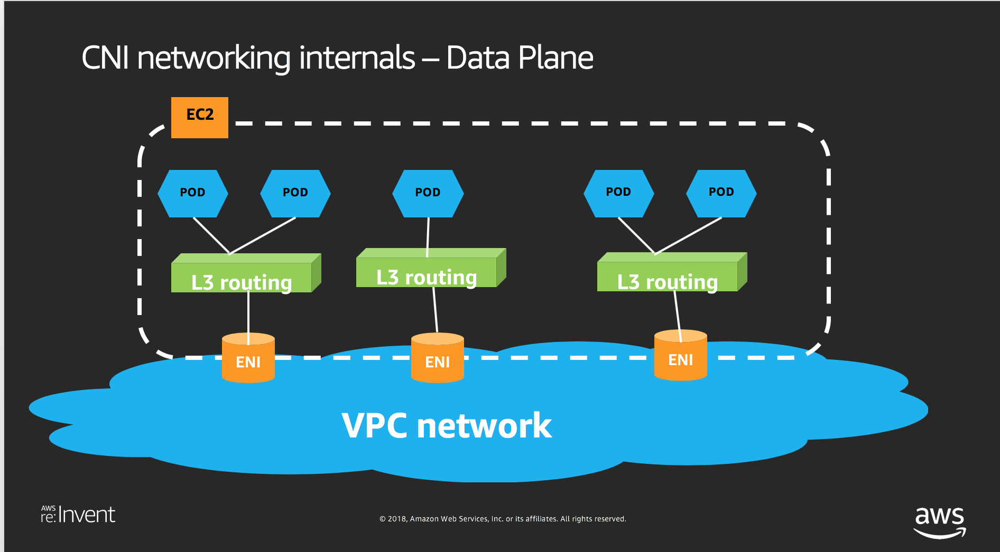

### Implementation Details

* Rely on **Linux Routing Table** to forward traffic to the right Pod
* Rely on **Linux Policy Routing**, IP rules to enforce Pod's traffic are sent out on the correct ENI.  For example, if a Pod1 is assigned with a secondary IP address from `eth2`, Linux Policy Routing IP rules will be programmed to enforce Pod1's outgoing traffic is sent out through `eth2`

### Life of a Ping Packet

#### overview


#### Life of Packet: Pod1-to-Pod3, across nodes
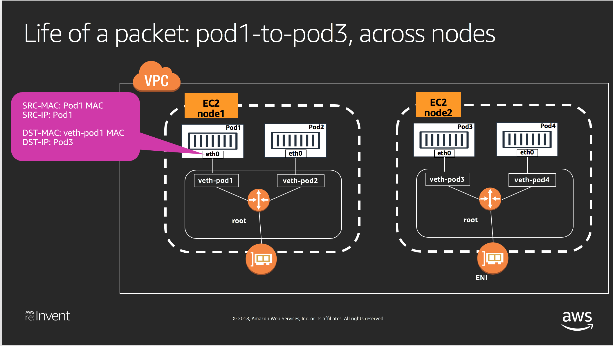
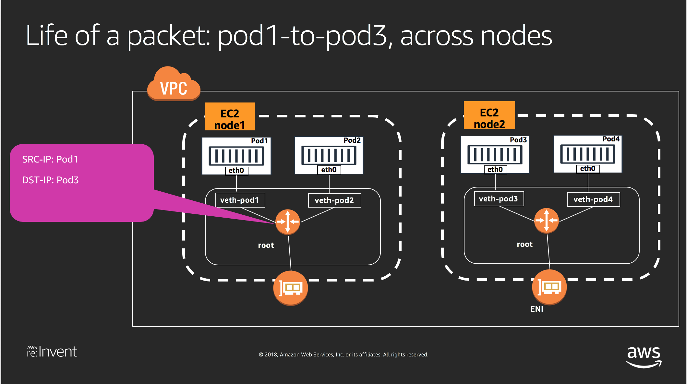

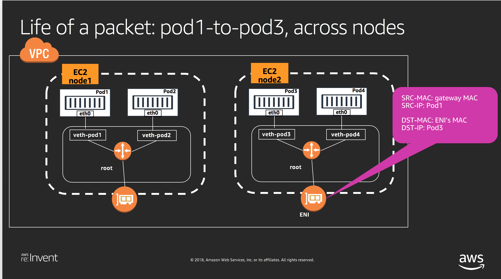
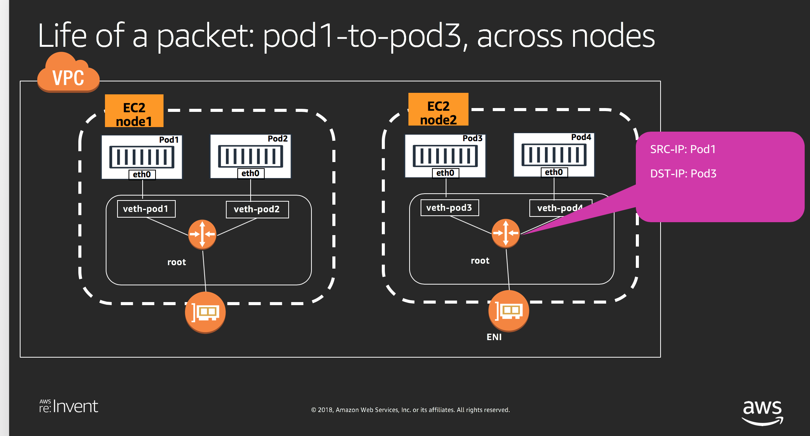
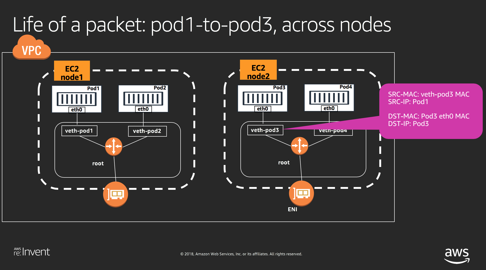 
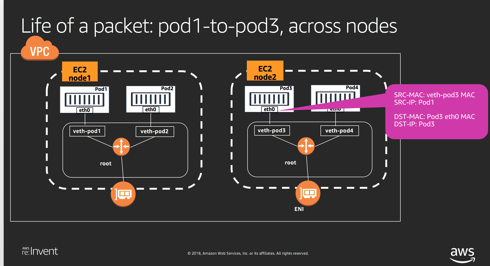


### Inside Pod

notes: the following are data from my setup.

```
[ec2-user@ip-172-31-9-36 reinvent2018-NET410]$ kubectl exec -ti worker-hello-5d9b798f74-2gnkc sh
```

#### `192.168.7.62` is the secondary IP addess from ENI
```
/go # ifconfig
eth0      Link encap:Ethernet  HWaddr EE:0A:C5:67:B7:90
          inet addr:192.168.7.62  Bcast:192.168.7.62  Mask:255.255.255.255
          UP BROADCAST RUNNING MULTICAST  MTU:1500  Metric:1
          RX packets:35 errors:0 dropped:0 overruns:0 frame:0
          TX packets:21 errors:0 dropped:0 overruns:0 carrier:0
          collisions:0 txqueuelen:0
          RX bytes:3754 (3.6 KiB)  TX bytes:1814 (1.7 KiB)

lo        Link encap:Local Loopback
          inet addr:127.0.0.1  Mask:255.0.0.0
          UP LOOPBACK RUNNING  MTU:65536  Metric:1
          RX packets:0 errors:0 dropped:0 overruns:0 frame:0
          TX packets:0 errors:0 dropped:0 overruns:0 carrier:0
          collisions:0 txqueuelen:1000
          RX bytes:0 (0.0 B)  TX bytes:0 (0.0 B)
```

#### showing pod route table

* All Pod's outgoing traffic will be sent out Pod's `eth0` interface

```
/go #ip route
default via 169.254.1.1 dev eth0
169.254.1.1 dev eth0 scope link
```

#### showing pod arp table

```
/go # arp
ip-192-168-4-93.eu-west-1.compute.internal (192.168.4.93) at 7e:3d:34:ba:01:5c [ether]  on eth0
? (169.254.1.1) at 7e:3d:34:ba:01:5c [ether] PERM on eth0
```

### Inside Worker

#### ssh into a worker node
```
ssh -i <your-key-name> ec2-user@34.245.125.220
The authenticity of host '34.245.125.220 (34.245.125.220)' can't be established.
ECDSA key fingerprint is SHA256:vVZkTtTkE06bGK0vBtKJPjUv1HzBi/UFwmXOLd/Eysg.
Are you sure you want to continue connecting (yes/no)? yes
Warning: Permanently added '34.245.125.220' (ECDSA) to the list of known hosts.
Last login: Tue Oct 23 20:46:31 2018 from 205.251.233.51

       __|  __|_  )
       _|  (     /   Amazon Linux 2 AMI
      ___|\___|___|

https://aws.amazon.com/amazon-linux-2/

```

#### Install tcpdump
```
[ec2-user@ip-192-168-4-93 ~]$ sudo yum install tcpdump
Loaded plugins: priorities, update-motd
amzn2-core                                                                                                                                                                                                              | 2.4 kB  00:00:00
amzn2extra-docker                                                                                                                                                                                                       | 1.3 kB  00:00:00
Resolving Dependencies
--> Running transaction check
---> Package tcpdump.x86_64 14:4.9.2-3.amzn2 will be installed
--> Processing Dependency: libpcap >= 14:1.5.3-10 for package: 14:tcpdump-4.9.2-3.amzn2.x86_64
--> Processing Dependency: libpcap.so.1()(64bit) for package: 14:tcpdump-4.9.2-3.amzn2.x86_64
--> Running transaction check
---> Package libpcap.x86_64 14:1.5.3-11.amzn2 will be installed
--> Finished Dependency Resolution

Dependencies Resolved

===============================================================================================================================================================================================================================================
 Package                                                Arch                                                  Version                                                          Repository                                                 Size
===============================================================================================================================================================================================================================================
Installing:
 tcpdump                                                x86_64                                                14:4.9.2-3.amzn2                                                 amzn2-core                                                428 k
Installing for dependencies:
 libpcap                                                x86_64                                                14:1.5.3-11.amzn2                                                amzn2-core                                                140 k

Transaction Summary
===============================================================================================================================================================================================================================================
Install  1 Package (+1 Dependent package)

Total download size: 568 k
Installed size: 1.3 M
Is this ok [y/d/N]: y
Downloading packages:
(1/2): libpcap-1.5.3-11.amzn2.x86_64.rpm                                                                                                                                                                                | 140 kB  00:00:00
(2/2): tcpdump-4.9.2-3.amzn2.x86_64.rpm                                                                                                                                                                                 | 428 kB  00:00:00
-----------------------------------------------------------------------------------------------------------------------------------------------------------------------------------------------------------------------------------------------
Total                                                                                                                                                                                                          7.6 MB/s | 568 kB  00:00:00
Running transaction check
Running transaction test
Transaction test succeeded
Running transaction
  Installing : 14:libpcap-1.5.3-11.amzn2.x86_64                                                                                                                                                                                            1/2
  Installing : 14:tcpdump-4.9.2-3.amzn2.x86_64                                                                                                                                                                                             2/2
  Verifying  : 14:libpcap-1.5.3-11.amzn2.x86_64                                                                                                                                                                                            1/2
  Verifying  : 14:tcpdump-4.9.2-3.amzn2.x86_64                                                                                                                                                                                             2/2

Installed:
  tcpdump.x86_64 14:4.9.2-3.amzn2

Dependency Installed:
  libpcap.x86_64 14:1.5.3-11.amzn2

Complete!
```

#### Route Table for to-Pod traffic

#####  Pod `192.168.7.62`(worker-hello-5d9b798f74-72q5t) is attached to Linux *veth*: `eni6a241e7f902`

```
[ec2-user@ip-192-168-4-93 ~]$ ip route
default via 192.168.0.1 dev eth0
169.254.169.254 dev eth0
172.17.0.0/16 dev docker0 proto kernel scope link src 172.17.0.1 linkdown
192.168.0.0/19 dev eth0 proto kernel scope link src 192.168.4.93
192.168.3.24 dev eni1f29a933002 scope link
192.168.7.54 dev eni5eaa472d76b scope link
192.168.7.62 dev eni6a241e7f902 scope link <-- worker-hello-5d9b798f74-72q5t
192.168.9.15 dev eni3ba2d1492d5 scope link
192.168.10.216 dev enidcee159cf44 scope link
192.168.20.139 dev eniccbdba09bad scope link
192.168.24.73 dev enie96d6354f21 scope link
192.168.29.205 dev eni8a6f029b3bc scope link
```

#### Route Table for from-Pod Traffic
* Program Pod's static ARP table with veth's MAC address, so that Pod knows how to resolve its default gateway's MAC

```
# mac address (7e:3d:34:ba:01:5c) matches Pod's ARP entry.

[ec2-user@ip-192-168-4-93 ~]$ ifconfig eni6a241e7f902
eni6a241e7f902: flags=4163<UP,BROADCAST,RUNNING,MULTICAST>  mtu 1500
        inet6 fe80::7c3d:34ff:feba:15c  prefixlen 64  scopeid 0x20<link>
        ether 7e:3d:34:ba:01:5c  txqueuelen 0  (Ethernet)
        RX packets 24  bytes 2025 (1.9 KiB)
        RX errors 0  dropped 0  overruns 0  frame 0
        TX packets 39  bytes 4150 (4.0 KiB)
        TX errors 0  dropped 0 overruns 0  carrier 0  collisions 0

```

* **Linux Policy Routing** is used to enforce Pod's outgoing traffic is sent out through the ENI that Pod's IP belongs to

```
# Poicy routing
[ec2-user@ip-192-168-4-93 ~]$ ip rule show
0:	from all lookup local
512:	from all to 192.168.24.73 lookup main
512:	from all to 192.168.29.205 lookup main
512:	from all to 192.168.7.62 lookup main
512:	from all to 192.168.9.15 lookup main
512:	from all to 192.168.7.54 lookup main
512:	from all to 192.168.3.24 lookup main
512:	from all to 192.168.10.216 lookup main
512:	from all to 192.168.20.139 lookup main
1024:	not from all to 192.168.0.0/16 lookup main
1024:	from all fwmark 0x80/0x80 lookup main
1536:	from 192.168.3.24 lookup 2 <-- these Pods uses IPs from secondary ENI (eth1)
1536:	from 192.168.10.216 lookup 2
1536:	from 192.168.20.139 lookup 2
32766:	from all lookup main
32767:	from all lookup default
```

```
# show route table 2

[ec2-user@ip-192-168-4-93 ~]$ ip route show table 2
default via 192.168.128.1 dev eth1 <-- outgoing eth1
192.168.128.1 dev eth1 scope link
```

#### exam Pod's traffic

#####  ping from Pod (192.168.7.62) on node (ip-192-168-4-93) to Pod (192.168.79.49) on node (ip-192-168-77-144)

```
[ec2-user@ip-172-31-9-36 reinvent2018-NET410]$ kubectl exec -ti worker-hello-5d9b798f74-2gnkc  sh

 /go # ping 192.168.79.49
PING 192.168.79.49 (192.168.79.49): 56 data bytes
64 bytes from 192.168.79.49: seq=0 ttl=253 time=0.788 ms
64 bytes from 192.168.79.49: seq=1 ttl=253 time=0.785 ms
64 bytes from 192.168.79.49: seq=2 ttl=253 time=0.913 ms
64 bytes from 192.168.79.49: seq=3 ttl=253 time=0.886 ms
64 bytes from 192.168.79.49: seq=4 ttl=253 time=0.909 ms
64 bytes from 192.168.79.49: seq=5 ttl=253 time=0.927 ms

```

##### Open a second window and ssh into the worker node

##### Exam packet on Pod's veth interface `eni6a241e7f902`
```
[ec2-user@ip-192-168-4-93 ~]$ sudo tcpdump -i eni6a241e7f902
tcpdump: verbose output suppressed, use -v or -vv for full protocol decode
listening on eni6a241e7f902, link-type EN10MB (Ethernet), capture size 262144 bytes
20:10:51.935972 IP ip-192-168-7-62.eu-west-1.compute.internal > ip-192-168-79-49.eu-west-1.compute.internal: ICMP echo request, id 3584, seq 31, length 64
20:10:51.936866 IP ip-192-168-79-49.eu-west-1.compute.internal > ip-192-168-7-62.eu-west-1.compute.internal: ICMP echo reply, id 3584, seq 31, length 64
20:10:52.936154 IP ip-192-168-7-62.eu-west-1.compute.internal > ip-192-168-79-49.eu-west-1.compute.internal: ICMP echo request, id 3584, seq 32, length 64
20:10:52.936929 IP ip-192-168-79-49.eu-west-1.compute.internal > ip-192-168-7-62.eu-west-1.compute.internal: ICMP echo reply, id 3584, seq 32, length 64
^C
4 packets captured
4 packets received by filter
0 packets dropped by kernel
```

##### Exam Ping packet on eth0  for ICMP packet (!make sure only exam icmp)
```
[ec2-user@ip-192-168-4-93 ~]$ sudo tcpdump -i eth0 icmp
tcpdump: verbose output suppressed, use -v or -vv for full protocol decode
listening on eth0, link-type EN10MB (Ethernet), capture size 262144 bytes
20:12:50.955549 IP ip-192-168-7-62.eu-west-1.compute.internal > ip-192-168-79-49.eu-west-1.compute.internal: ICMP echo request, id 3584, seq 150, length 64
20:12:50.956252 IP ip-192-168-79-49.eu-west-1.compute.internal > ip-192-168-7-62.eu-west-1.compute.internal: ICMP echo reply, id 3584, seq 150, length 64
20:12:51.955701 IP ip-192-168-7-62.eu-west-1.compute.internal > ip-192-168-79-49.eu-west-1.compute.internal: ICMP echo request, id 3584, seq 151, length 64
20:12:51.956463 IP ip-192-168-79-49.eu-west-1.compute.internal > ip-192-168-7-62.eu-west-1.compute.internal: ICMP echo reply, id 3584, seq 151, length 64
20:12:52.955856 IP ip-192-168-7-62.eu-west-1.compute.internal > ip-192-168-79-49.eu-west-1.compute.internal: ICMP echo request, id 3584, seq 152, length 64
20:12:52.956634 IP ip-192-168-79-49.eu-west-1.compute.internal > ip-192-168-7-62.eu-west-1.compute.internal: ICMP echo reply, id 3584, seq 152, length 64
^C
6 packets captured
6 packets received by filter
0 packets dropped by kernel
```

### Pod to Service Communication

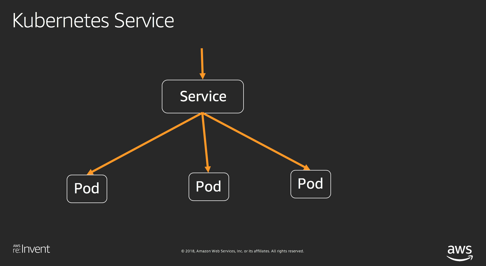

#### Kubernetes Service
Kubernetes is a service that Pods such as `kube-dns` can Read/Write/Watch Kubernetes API objects

```
[ec2-user@ip-172-31-9-36 reinvent2018-NET410]$ kubectl get service
NAME         TYPE        CLUSTER-IP   EXTERNAL-IP   PORT(S)   AGE
kubernetes   ClusterIP   10.100.0.1   <none>        443/TCP   18h
```

#### Kubernetes Service EndPoints (EKS masters)

```
[ec2-user@ip-172-31-9-36 reinvent2018-NET410]$ kubectl describe service kubernetes
Name:              kubernetes
Namespace:         default
Labels:            component=apiserver
                   provider=kubernetes
Annotations:       <none>
Selector:          <none>
Type:              ClusterIP
IP:                10.100.0.1
Port:              https  443/TCP
TargetPort:        443/TCP
Endpoints:         192.168.119.102:443,192.168.154.135:443 <-- cross ENIs for EKS masters
Session Affinity:  ClientIP
Events:            <none>
```

#### IPtables for Kubernetes Service

* IPtables is used to handle Pod to service traffic

#### Life of a Packet: Pod to Service
* `kube-dns` Pod communicate with `kubernetes service` and discover kubernetes service name and kubernetes service cluster IP

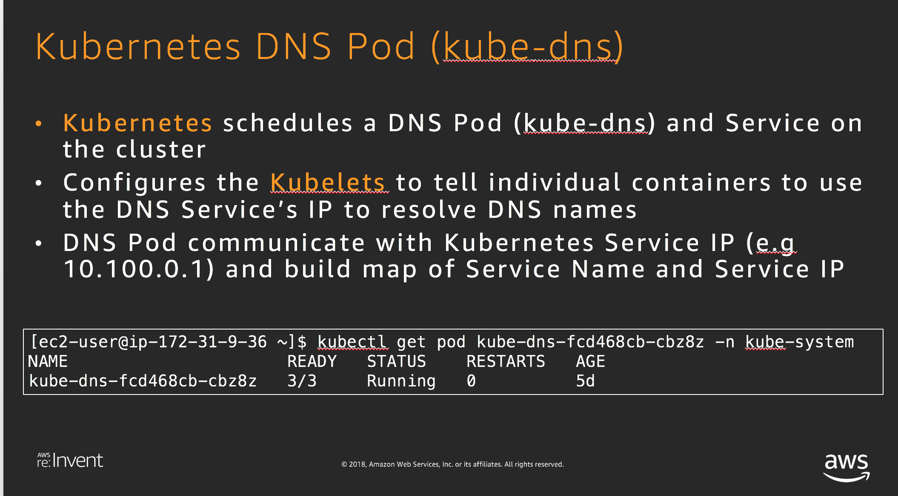

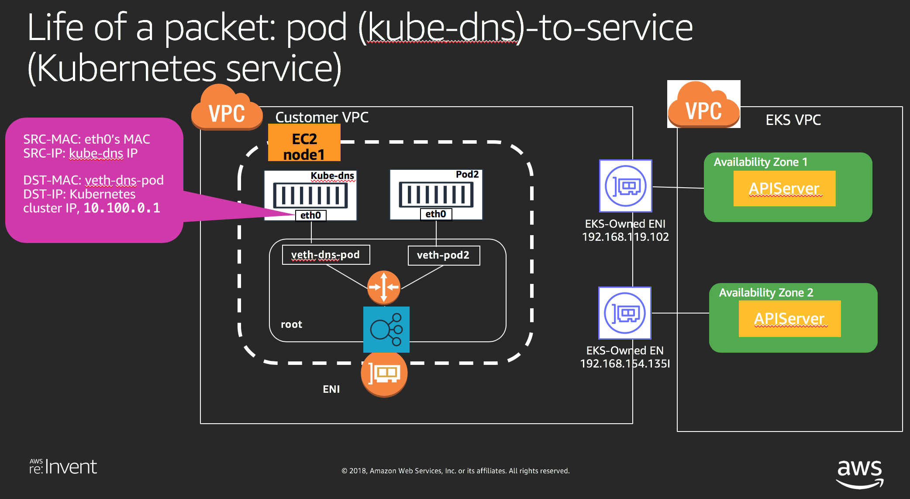
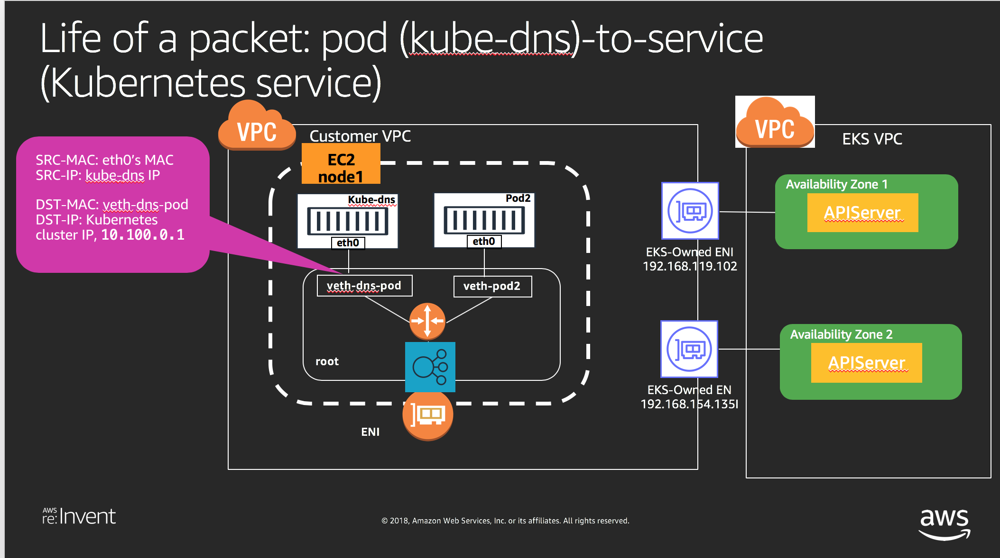
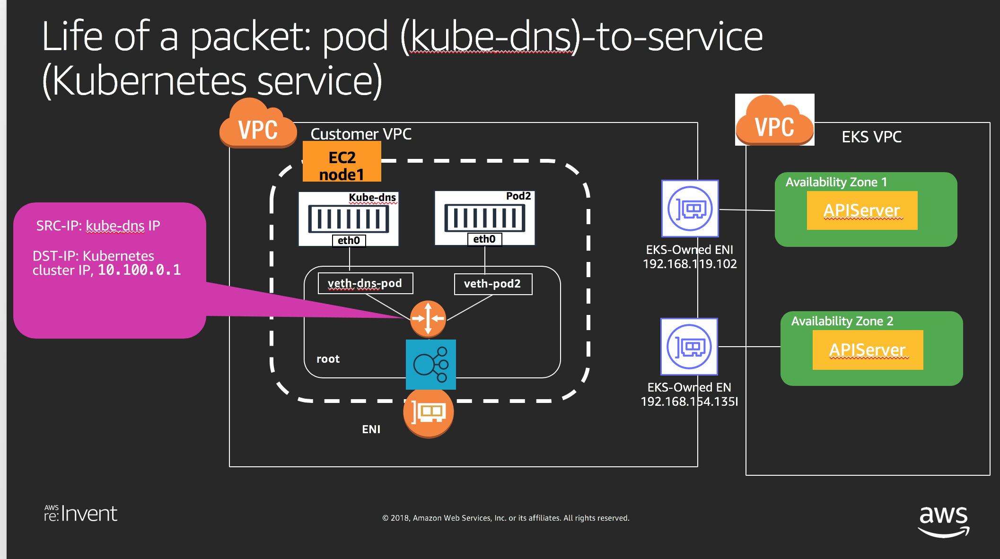

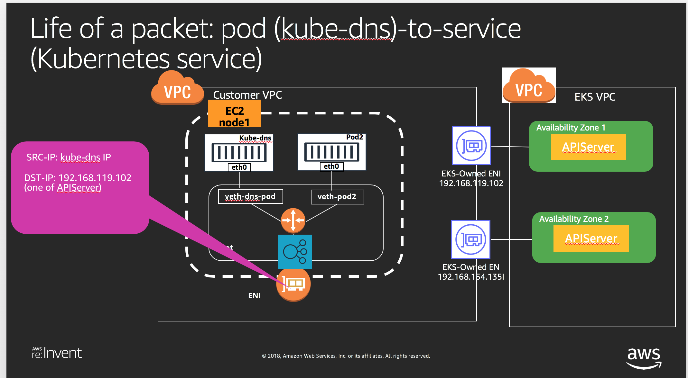
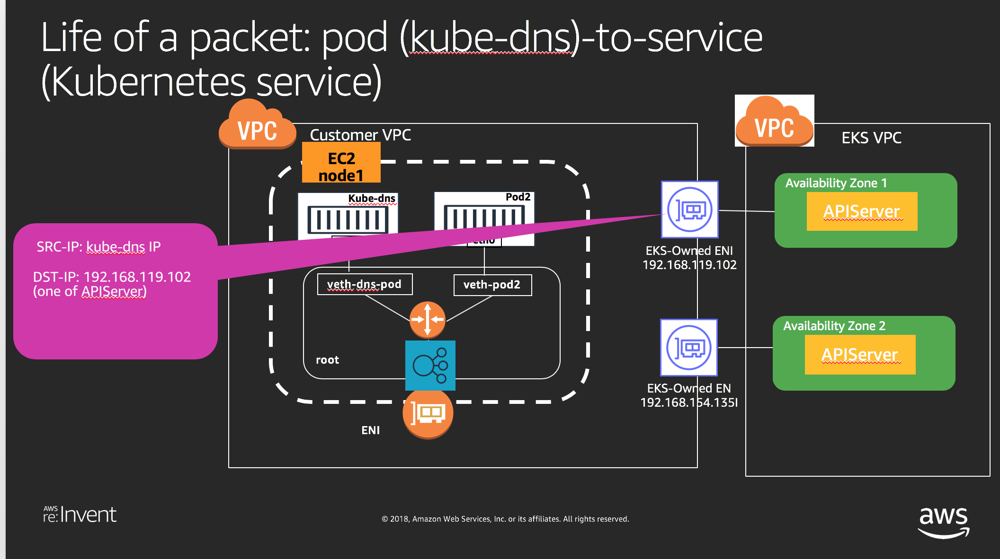
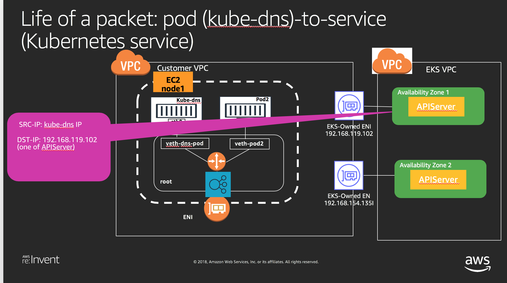


##### ssh into worker node

##### Display Linux IP tables

```
[ec2-user@ip-192-168-4-93 ~]$ sudo iptables-save
# Generated by iptables-save v1.4.21 on Mon Nov 19 20:27:10 2018
*mangle
:PREROUTING ACCEPT [604975:226116018]
:INPUT ACCEPT [603197:225965893]
:FORWARD ACCEPT [1778:150125]
:OUTPUT ACCEPT [572775:69717956]
:POSTROUTING ACCEPT [574553:69868081]
-A PREROUTING -i eth0 -m comment --comment "AWS, primary ENI" -m addrtype --dst-type LOCAL --limit-iface-in -j CONNMARK --set-xmark 0x80/0x80
-A PREROUTING -i eni+ -m comment --comment "AWS, primary ENI" -j CONNMARK --restore-mark --nfmask 0x80 --ctmask 0x80
COMMIT
# Completed on Mon Nov 19 20:27:10 2018
# Generated by iptables-save v1.4.21 on Mon Nov 19 20:27:10 2018
*nat
:PREROUTING ACCEPT [0:0]
:INPUT ACCEPT [0:0]
:OUTPUT ACCEPT [0:0]
:POSTROUTING ACCEPT [0:0]
:DOCKER - [0:0]
:KUBE-MARK-DROP - [0:0]
:KUBE-MARK-MASQ - [0:0]
:KUBE-NODEPORTS - [0:0]
:KUBE-POSTROUTING - [0:0]
:KUBE-SEP-2NU4G5DQKUWR2CN3 - [0:0]
:KUBE-SEP-SBYITFTVBG66OBOJ - [0:0]
:KUBE-SEP-U7PHXUKERII2F73Z - [0:0]
:KUBE-SEP-VM7IXZRFNUK7QDNK - [0:0]
:KUBE-SERVICES - [0:0]
:KUBE-SVC-ERIFXISQEP7F7OF4 - [0:0]
:KUBE-SVC-NPX46M4PTMTKRN6Y - [0:0]
:KUBE-SVC-TCOU7JCQXEZGVUNU - [0:0]
-A PREROUTING -m comment --comment "kubernetes service portals" -j KUBE-SERVICES
-A PREROUTING -m addrtype --dst-type LOCAL -j DOCKER
-A OUTPUT -m comment --comment "kubernetes service portals" -j KUBE-SERVICES
-A OUTPUT ! -d 127.0.0.0/8 -m addrtype --dst-type LOCAL -j DOCKER
-A POSTROUTING -m comment --comment "kubernetes postrouting rules" -j KUBE-POSTROUTING
-A POSTROUTING -s 172.17.0.0/16 ! -o docker0 -j MASQUERADE
-A POSTROUTING ! -d 192.168.0.0/16 -m comment --comment "AWS, SNAT" -m addrtype ! --dst-type LOCAL -j SNAT --to-source 192.168.4.93
-A DOCKER -i docker0 -j RETURN
-A KUBE-MARK-DROP -j MARK --set-xmark 0x8000/0x8000
-A KUBE-MARK-MASQ -j MARK --set-xmark 0x4000/0x4000
-A KUBE-POSTROUTING -m comment --comment "kubernetes service traffic requiring SNAT" -m mark --mark 0x4000/0x4000 -j MASQUERADE
-A KUBE-SEP-2NU4G5DQKUWR2CN3 -s 192.168.64.27/32 -m comment --comment "kube-system/kube-dns:dns-tcp" -j KUBE-MARK-MASQ
-A KUBE-SEP-2NU4G5DQKUWR2CN3 -p tcp -m comment --comment "kube-system/kube-dns:dns-tcp" -m tcp -j DNAT --to-destination 192.168.64.27:53
-A KUBE-SEP-SBYITFTVBG66OBOJ -s 192.168.64.27/32 -m comment --comment "kube-system/kube-dns:dns" -j KUBE-MARK-MASQ
-A KUBE-SEP-SBYITFTVBG66OBOJ -p udp -m comment --comment "kube-system/kube-dns:dns" -m udp -j DNAT --to-destination 192.168.64.27:53
-A KUBE-SEP-U7PHXUKERII2F73Z -s 192.168.119.102/32 -m comment --comment "default/kubernetes:https" -j KUBE-MARK-MASQ
-A KUBE-SEP-U7PHXUKERII2F73Z -p tcp -m comment --comment "default/kubernetes:https" -m recent --set --name KUBE-SEP-U7PHXUKERII2F73Z --mask 255.255.255.255 --rsource -m tcp -j DNAT --to-destination 192.168.119.102:443
-A KUBE-SEP-VM7IXZRFNUK7QDNK -s 192.168.154.135/32 -m comment --comment "default/kubernetes:https" -j KUBE-MARK-MASQ
-A KUBE-SEP-VM7IXZRFNUK7QDNK -p tcp -m comment --comment "default/kubernetes:https" -m recent --set --name KUBE-SEP-VM7IXZRFNUK7QDNK --mask 255.255.255.255 --rsource -m tcp -j DNAT --to-destination 192.168.154.135:443
-A KUBE-SERVICES -d 10.100.0.1/32 -p tcp -m comment --comment "default/kubernetes:https cluster IP" -m tcp --dport 443 -j KUBE-SVC-NPX46M4PTMTKRN6Y
-A KUBE-SERVICES -d 10.100.0.10/32 -p udp -m comment --comment "kube-system/kube-dns:dns cluster IP" -m udp --dport 53 -j KUBE-SVC-TCOU7JCQXEZGVUNU
-A KUBE-SERVICES -d 10.100.0.10/32 -p tcp -m comment --comment "kube-system/kube-dns:dns-tcp cluster IP" -m tcp --dport 53 -j KUBE-SVC-ERIFXISQEP7F7OF4
-A KUBE-SERVICES -m comment --comment "kubernetes service nodeports; NOTE: this must be the last rule in this chain" -m addrtype --dst-type LOCAL -j KUBE-NODEPORTS
-A KUBE-SVC-ERIFXISQEP7F7OF4 -m comment --comment "kube-system/kube-dns:dns-tcp" -j KUBE-SEP-2NU4G5DQKUWR2CN3
-A KUBE-SVC-NPX46M4PTMTKRN6Y -m comment --comment "default/kubernetes:https" -m recent --rcheck --seconds 10800 --reap --name KUBE-SEP-U7PHXUKERII2F73Z --mask 255.255.255.255 --rsource -j KUBE-SEP-U7PHXUKERII2F73Z
-A KUBE-SVC-NPX46M4PTMTKRN6Y -m comment --comment "default/kubernetes:https" -m recent --rcheck --seconds 10800 --reap --name KUBE-SEP-VM7IXZRFNUK7QDNK --mask 255.255.255.255 --rsource -j KUBE-SEP-VM7IXZRFNUK7QDNK
-A KUBE-SVC-NPX46M4PTMTKRN6Y -m comment --comment "default/kubernetes:https" -m statistic --mode random --probability 0.50000000000 -j KUBE-SEP-U7PHXUKERII2F73Z
-A KUBE-SVC-NPX46M4PTMTKRN6Y -m comment --comment "default/kubernetes:https" -j KUBE-SEP-VM7IXZRFNUK7QDNK
-A KUBE-SVC-TCOU7JCQXEZGVUNU -m comment --comment "kube-system/kube-dns:dns" -j KUBE-SEP-SBYITFTVBG66OBOJ
COMMIT
# Completed on Mon Nov 19 20:27:10 2018
# Generated by iptables-save v1.4.21 on Mon Nov 19 20:27:10 2018
*filter
:INPUT ACCEPT [41:6221]
:FORWARD ACCEPT [0:0]
:OUTPUT ACCEPT [33:4352]
:KUBE-EXTERNAL-SERVICES - [0:0]
:KUBE-FIREWALL - [0:0]
:KUBE-FORWARD - [0:0]
:KUBE-SERVICES - [0:0]
-A INPUT -m conntrack --ctstate NEW -m comment --comment "kubernetes externally-visible service portals" -j KUBE-EXTERNAL-SERVICES
-A INPUT -j KUBE-FIREWALL
-A FORWARD -m comment --comment "kubernetes forwarding rules" -j KUBE-FORWARD
-A OUTPUT -m conntrack --ctstate NEW -m comment --comment "kubernetes service portals" -j KUBE-SERVICES
-A OUTPUT -j KUBE-FIREWALL
-A KUBE-FIREWALL -m comment --comment "kubernetes firewall for dropping marked packets" -m mark --mark 0x8000/0x8000 -j DROP
-A KUBE-FORWARD -m comment --comment "kubernetes forwarding rules" -m mark --mark 0x4000/0x4000 -j ACCEPT
COMMIT
# Completed on Mon Nov 19 20:27:10 2018

```

### CNI Network Internals - Control Plane

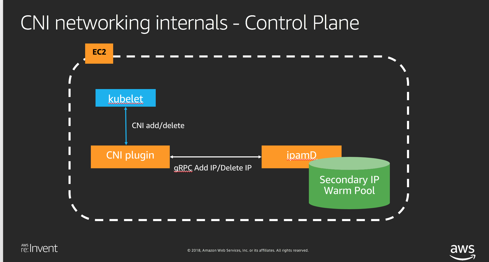


#### Display ipamD IP Warm Pool

##### ENIs

```
[ec2-user@ip-192-168-4-93 bin]$ curl http://localhost:61678/v1/enis | python -m json.tool
  % Total    % Received % Xferd  Average Speed   Time    Time     Time  Current
                                 Dload  Upload   Total   Spent    Left  Speed
100   967  100   967    0     0    967      0  0:00:01 --:--:--  0:00:01  188k
{
    "AssignedIPs": 8,
    "ENIIPPools": {
        "eni-0334a44d21188bd24": {
            "AssignedIPv4Addresses": 5,
            "DeviceNumber": 0,
            "ID": "eni-0334a44d21188bd24",
            "IPv4Addresses": {
                "192.168.24.73": {
                    "Assigned": true
                },
                "192.168.29.205": {
                    "Assigned": true
                },
                "192.168.7.54": {
                    "Assigned": true
                },
                "192.168.7.62": {
                    "Assigned": true
                },
                "192.168.9.15": {
                    "Assigned": true
                }
            },
            "IsPrimary": true
        },
        "eni-0458b317b891b1d40": {
            "AssignedIPv4Addresses": 0,
            "DeviceNumber": 3,
            "ID": "eni-0458b317b891b1d40",
            "IPv4Addresses": {
                "192.168.13.192": {
                    "Assigned": false
                },
                "192.168.13.63": {
                    "Assigned": false
                },
                "192.168.15.43": {
                    "Assigned": false
                },
                "192.168.19.112": {
                    "Assigned": false
                },
                "192.168.30.180": {
                    "Assigned": false
                }
            },
            "IsPrimary": false
        },
        "eni-08f89b8d2799ddf95": {
            "AssignedIPv4Addresses": 3,
            "DeviceNumber": 2,
            "ID": "eni-08f89b8d2799ddf95",
            "IPv4Addresses": {
                "192.168.10.216": {
                    "Assigned": true
                },
                "192.168.14.110": {
                    "Assigned": false
                },
                "192.168.20.139": {
                    "Assigned": true
                },
                "192.168.3.161": {
                    "Assigned": false
                },
                "192.168.3.24": {
                    "Assigned": true
                }
            },
            "IsPrimary": false
        }
    },
    "TotalIPs": 15
}
```

##### Pods

```
[ec2-user@ip-192-168-4-93 bin]$ curl http://localhost:61678/v1/pods  | python -m json.tool
  % Total    % Received % Xferd  Average Speed   Time    Time     Time  Current
                                 Dload  Upload   Total   Spent    Left  Speed
100  1160  100  1160    0     0   1160      0  0:00:01 --:--:--  0:00:01  226k
{
    "worker-hello-5d9b798f74-2gnkc_default_0e3bdc55d56b8b171568404094449834f5978de4aebfb1b51cb3af8338c24395": {
        "DeviceNumber": 0,
        "IP": "192.168.7.62"
    },
    "worker-hello-5d9b798f74-h2x78_default_546fba2f45815f5063127b7c2c17e12309b2f100900b921712aa8e1cc5c22d3d": {
        "DeviceNumber": 2,
        "IP": "192.168.10.216"
    },
    "worker-hello-5d9b798f74-ktdxl_default_e578863a41cc43a30d375f9be3f547371cf712d2923038dd2e57cdb2e8fa5c65": {
        "DeviceNumber": 2,
        "IP": "192.168.3.24"
    },
    "worker-hello-5d9b798f74-nqg89_default_a8d205604fe0b41a57aeb748ffa12a4f14b2461f4da173717f8905dee49dfd18": {
        "DeviceNumber": 0,
        "IP": "192.168.24.73"
    },
    "worker-hello-5d9b798f74-szjsd_default_9fd147019bdfb553adaaed836c167c2d51d91a70fa81fe6fb2d9698bc192ce78": {
        "DeviceNumber": 0,
        "IP": "192.168.29.205"
    },
    "worker-hello-5d9b798f74-wrw8r_default_d621c464bc7f72378be650711f4fc92b7a4a40ca9d2c4905636e8d0f9fa8a764": {
        "DeviceNumber": 2,
        "IP": "192.168.20.139"
    },
    "worker-hello-5d9b798f74-xhf5b_default_4a7e02a864fc5f534fda0d7069cb1568596ece393ebfa441898cdcfcafb7ce2e": {
        "DeviceNumber": 0,
        "IP": "192.168.7.54"
    },
    "worker-hello-5d9b798f74-zk7c7_default_2aa3442e7c611e52ca6ca97cdeb8a732012e51a27ae70e7fdfca4e5b3f925802": {
        "DeviceNumber": 0,
        "IP": "192.168.9.15"
    }
}
```

##### CNI metrics

```
[ec2-user@ip-192-168-4-93 bin]$ curl http://localhost:61678/metrics
# HELP add_ip_req_count The number of add IP address request
# TYPE add_ip_req_count counter
add_ip_req_count 72
# HELP assigned_ip_addresses The number of IP addresses assigned to pods
# TYPE assigned_ip_addresses gauge
assigned_ip_addresses 8
# HELP eni_allocated The number of ENIs allocated
# TYPE eni_allocated gauge
eni_allocated 3
# HELP eni_max The maximum number of ENIs that can be attached to the instance
# TYPE eni_max gauge
eni_max 3
# HELP go_gc_duration_seconds A summary of the GC invocation durations.
# TYPE go_gc_duration_seconds summary
go_gc_duration_seconds{quantile="0"} 2.7068e-05
go_gc_duration_seconds{quantile="0.25"} 6.1571e-05
go_gc_duration_seconds{quantile="0.5"} 0.000100168
go_gc_duration_seconds{quantile="0.75"} 0.000197111
go_gc_duration_seconds{quantile="1"} 0.000349902
go_gc_duration_seconds_sum 0.076581308
go_gc_duration_seconds_count 578
# HELP go_goroutines Number of goroutines that currently exist.
# TYPE go_goroutines gauge
go_goroutines 23
# HELP go_memstats_alloc_bytes Number of bytes allocated and still in use.
# TYPE go_memstats_alloc_bytes gauge
go_memstats_alloc_bytes 5.184912e+06
# HELP go_memstats_alloc_bytes_total Total number of bytes allocated, even if freed.
# TYPE go_memstats_alloc_bytes_total counter
go_memstats_alloc_bytes_total 2.0154212e+08
# HELP go_memstats_buck_hash_sys_bytes Number of bytes used by the profiling bucket hash table.
# TYPE go_memstats_buck_hash_sys_bytes gauge
go_memstats_buck_hash_sys_bytes 1.477868e+06
# HELP go_memstats_frees_total Total number of frees.
# TYPE go_memstats_frees_total counter
go_memstats_frees_total 2.329102e+06
# HELP go_memstats_gc_sys_bytes Number of bytes used for garbage collection system metadata.
# TYPE go_memstats_gc_sys_bytes gauge
go_memstats_gc_sys_bytes 614400
# HELP go_memstats_heap_alloc_bytes Number of heap bytes allocated and still in use.
# TYPE go_memstats_heap_alloc_bytes gauge
go_memstats_heap_alloc_bytes 5.184912e+06
# HELP go_memstats_heap_idle_bytes Number of heap bytes waiting to be used.
# TYPE go_memstats_heap_idle_bytes gauge
go_memstats_heap_idle_bytes 4.308992e+06
# HELP go_memstats_heap_inuse_bytes Number of heap bytes that are in use.
# TYPE go_memstats_heap_inuse_bytes gauge
go_memstats_heap_inuse_bytes 7.716864e+06
# HELP go_memstats_heap_objects Number of allocated objects.
# TYPE go_memstats_heap_objects gauge
go_memstats_heap_objects 36396
# HELP go_memstats_heap_released_bytes_total Total number of heap bytes released to OS.
# TYPE go_memstats_heap_released_bytes_total counter
go_memstats_heap_released_bytes_total 4.120576e+06
# HELP go_memstats_heap_sys_bytes Number of heap bytes obtained from system.
# TYPE go_memstats_heap_sys_bytes gauge
go_memstats_heap_sys_bytes 1.2025856e+07
# HELP go_memstats_last_gc_time_seconds Number of seconds since 1970 of last garbage collection.
# TYPE go_memstats_last_gc_time_seconds gauge
go_memstats_last_gc_time_seconds 1.542659671256665e+09
# HELP go_memstats_lookups_total Total number of pointer lookups.
# TYPE go_memstats_lookups_total counter
go_memstats_lookups_total 13511
# HELP go_memstats_mallocs_total Total number of mallocs.
# TYPE go_memstats_mallocs_total counter
go_memstats_mallocs_total 2.365498e+06
# HELP go_memstats_mcache_inuse_bytes Number of bytes in use by mcache structures.
# TYPE go_memstats_mcache_inuse_bytes gauge
go_memstats_mcache_inuse_bytes 3472
# HELP go_memstats_mcache_sys_bytes Number of bytes used for mcache structures obtained from system.
# TYPE go_memstats_mcache_sys_bytes gauge
go_memstats_mcache_sys_bytes 16384
# HELP go_memstats_mspan_inuse_bytes Number of bytes in use by mspan structures.
# TYPE go_memstats_mspan_inuse_bytes gauge
go_memstats_mspan_inuse_bytes 110504
# HELP go_memstats_mspan_sys_bytes Number of bytes used for mspan structures obtained from system.
# TYPE go_memstats_mspan_sys_bytes gauge
go_memstats_mspan_sys_bytes 147456
# HELP go_memstats_next_gc_bytes Number of heap bytes when next garbage collection will take place.
# TYPE go_memstats_next_gc_bytes gauge
go_memstats_next_gc_bytes 9.6544e+06
# HELP go_memstats_other_sys_bytes Number of bytes used for other system allocations.
# TYPE go_memstats_other_sys_bytes gauge
go_memstats_other_sys_bytes 637964
# HELP go_memstats_stack_inuse_bytes Number of bytes in use by the stack allocator.
# TYPE go_memstats_stack_inuse_bytes gauge
go_memstats_stack_inuse_bytes 557056
# HELP go_memstats_stack_sys_bytes Number of bytes obtained from system for stack allocator.
# TYPE go_memstats_stack_sys_bytes gauge
go_memstats_stack_sys_bytes 557056
# HELP go_memstats_sys_bytes Number of bytes obtained by system. Sum of all system allocations.
# TYPE go_memstats_sys_bytes gauge
go_memstats_sys_bytes 1.5476984e+07
# HELP ip_max The maximum number of IP addresses that can be allocated to the instance
# TYPE ip_max gauge
ip_max 15
# HELP ipamd_action_inprogress The number of ipamd actions inprogress
# TYPE ipamd_action_inprogress gauge
ipamd_action_inprogress{fn="increaseIPPool"} 0
ipamd_action_inprogress{fn="nodeIPPoolReconcile"} 0
ipamd_action_inprogress{fn="nodeInit"} 0
ipamd_action_inprogress{fn="retryAllocENIIP"} 0
# HELP ipamd_error_count The number of errors encountered in ipamd
# TYPE ipamd_error_count counter
ipamd_error_count{error="unable to get local pods, giving up",fn="nodeInitK8SGetLocalPodIPsFailed"} 1
# HELP process_cpu_seconds_total Total user and system CPU time spent in seconds.
# TYPE process_cpu_seconds_total counter
process_cpu_seconds_total 99.94
# HELP process_max_fds Maximum number of open file descriptors.
# TYPE process_max_fds gauge
process_max_fds 65536
# HELP process_open_fds Number of open file descriptors.
# TYPE process_open_fds gauge
process_open_fds 10
# HELP process_resident_memory_bytes Resident memory size in bytes.
# TYPE process_resident_memory_bytes gauge
process_resident_memory_bytes 3.1432704e+07
# HELP process_start_time_seconds Start time of the process since unix epoch in seconds.
# TYPE process_start_time_seconds gauge
process_start_time_seconds 1.54259115532e+09
# HELP process_virtual_memory_bytes Virtual memory size in bytes.
# TYPE process_virtual_memory_bytes gauge
process_virtual_memory_bytes 4.8050176e+07
# HELP total_ip_addresses The total number of IP addresses
# TYPE total_ip_addresses gauge
total_ip_addresses 15

```

#### CNI logs

```
[ec2-user@ip-192-168-4-93 bin]$ cd /var/log/aws-routed-eni/
[ec2-user@ip-192-168-4-93 aws-routed-eni]$ ls
ipamd.log.2018-11-19-01  ipamd.log.2018-11-19-04  ipamd.log.2018-11-19-07  ipamd.log.2018-11-19-10  ipamd.log.2018-11-19-13  ipamd.log.2018-11-19-16  ipamd.log.2018-11-19-19
ipamd.log.2018-11-19-02  ipamd.log.2018-11-19-05  ipamd.log.2018-11-19-08  ipamd.log.2018-11-19-11  ipamd.log.2018-11-19-14  ipamd.log.2018-11-19-17  ipamd.log.2018-11-19-20
ipamd.log.2018-11-19-03  ipamd.log.2018-11-19-06  ipamd.log.2018-11-19-09  ipamd.log.2018-11-19-12  ipamd.log.2018-11-19-15  ipamd.log.2018-11-19-18  plugin.log.2018-11-19-19
```


