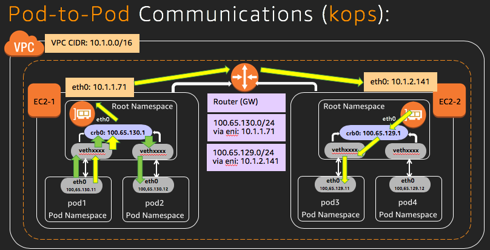
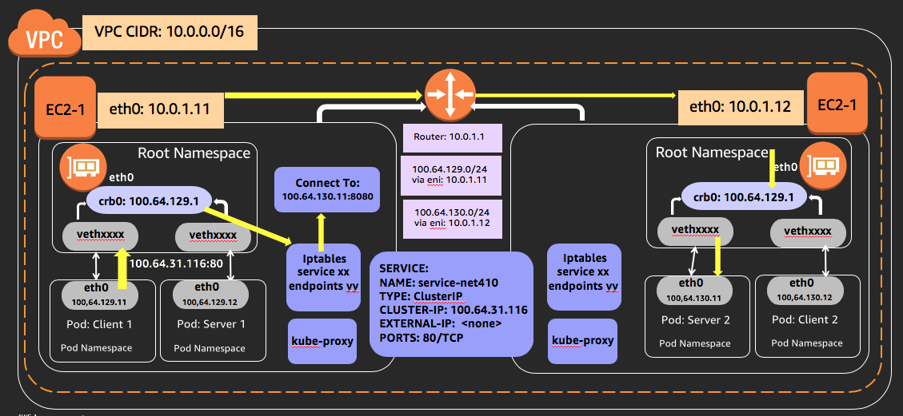
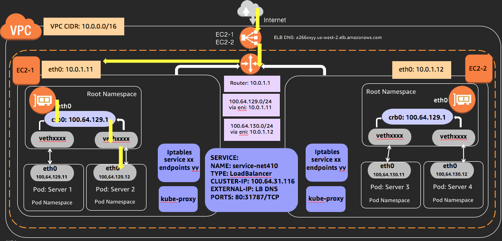

# aws kops Demo:

## Objective:

### Create kops cluster:

- In public subnet
- One master node
- Two worker nodes across two availability zones

### Deploy application across the cluster:

- Deploy busybox application
- Deploy simpleHttpServer application
- Deploy client application

### Packet flow for 3 communications pattern:

- pod-to-pod communication
- pod-to-service communication
- external-to-interal communication

### Understand concepts and limitations:

- Pods
- Service (types: Cluster-IP, NodePort, LoadBalance, Ingress)
- Network architecture (interfaces, bridge, route table, ip address)

## Workshop setup:

### Perform the clean up activity at the end of the activity before deleting the AWS CloudFormation stack

- kops cluster created using AWS CloudFormation template needs to be deleted through management instance: net410-workshop-kops-mgmt.
- Refer to **Clean up** activity at the end of the workshop activity
- If AWS CloudFormation is deleted without deleting the kops cluster, deleting kops cluster worker node instances becomes difficult.
  - We will enhance the workshop to handle clean up.
  - Until then, if you run into a situation where AWS CloudFormation stack and in turn net410-workshop-kops-mgmt instance is deleted without deleting the kops cluster, re-launch the AWS CloudFormation Stack, access net410-workshop-kops-mgmt instance and delete the cluster. Once the kops cluster is deleted, you can delete the AWS CloudFormation stack.

### Create kops cluster using [AWS CloudFormation Template](https://aws.amazon.com/cloudformation/):

- **For this workshop activity, we are using AWS CloudFormation template to configure workshop setup.**
- You should have launched the AWS CloudFormation template at the beginning of the workshop session and your cluster should be already up and running
- If you did not launch the AWS CloudFormation template or template did not launch successfully, you can re-launch AWS CloudFormation template from link below.
  - [AWS CloudFormation Template: NET410 Workshop Setup](https://console.aws.amazon.com/cloudformation/home?region=eu-west-1#/stacks/new?templateURL=https://s3-eu-west-1.amazonaws.com/net410-workshop-eu-west-1/net410-workshop-setup.json)
  - **Verify you are launching it in eu-west-1 (Ireland) region**:

## Before we begin:

### Access net410-workshop-kops-mgmt instance

- Click on [Amazon EC2 Console](https://eu-west-1.console.aws.amazon.com/ec2/v2/home?region=eu-west-1#Instances:search=net410-workshop-kops-mgmt;sort=tag:Nakops-mgmt)
to retrieve net410-workshop-kops-mgmt's public ip and ssh in to the instance
```
ssh -i <key-name>  ec2-user@ec2-xx-xx-xx-xx.eu-west-1.compute.amazonaws.com
```

### Clone github:

- Clone reinvent2018-NET410 github repository in $HOME directory:
```
git clone https://github.com/liwenwu-amazon/reinvent2018-NET410
```
```
[ec2-user@ip-172-31-25-39 ~]$ git clone https://github.com/liwenwu-amazon/reinvent2018-NET410
Cloning into 'reinvent2018-NET410'...
remote: Enumerating objects: 148, done.
remote: Counting objects: 100% (148/148), done.
remote: Compressing objects: 100% (112/112), done.
remote: Total 148 (delta 52), reused 114 (delta 31), pack-reused 0
Receiving objects: 100% (148/148), 1.83 MiB | 4.19 MiB/s, done.
Resolving deltas: 100% (52/52), done.
[ec2-user@ip-172-31-25-39 ~]$
```

## NET410 workshop activity: kops cluster

### Cluster details:

#### Cluster that was created using [AWS CloudFormation](https://aws.amazon.com/cloudformation/) consists of 1 master node and 2 worker nodes.

- Display cluster information:
```
kubectl cluster-info
```
```
[ec2-user@ip-172-31-25-39 ~]$ kubectl cluster-info
Kubernetes master is running at https://api-net410-kops-cluster-k-g6vaj6-9254634.eu-west-1.elb.amazonaws.com
KubeDNS is running at https://api-net410-kops-cluster-k-g6vaj6-9254634.eu-west-1.elb.amazonaws.com/api/v1/namespaces/kube-system/services/kube-dns:dns/proxy

To further debug and diagnose cluster problems, use 'kubectl cluster-info dump'.
[ec2-user@ip-172-31-25-39 ~]$
```

- Get cluster details: cluster and instance group:
```
kops get cluster net410-kops-cluster.k8s.local
```
```
[ec2-user@ip-172-31-25-39 ~]$ kops get cluster net410-kops-cluster.k8s.local
NAME                            CLOUD   ZONES
net410-kops-cluster.k8s.local   aws     eu-west-1a,eu-west-1b,eu-west-1c
[ec2-user@ip-172-31-25-39 ~]$
```

- Validate cluster state:
```
kops validate cluster net410-kops-cluster.k8s.local
```
```
[ec2-user@ip-172-31-25-39 ~]$ kops validate cluster net410-kops-cluster.k8s.local
Using cluster from kubectl context: net410-kops-cluster.k8s.local

Validating cluster net410-kops-cluster.k8s.local

INSTANCE GROUPS
NAME                        ROLE    MACHINETYPE     MIN     MAX     SUBNETS
master-eu-west-1a           Master  t2.small        1       1       eu-west-1a
nodes                       Node    t2.small        2       2       eu-west-1a,eu-west-1b,eu-west-1c

NODE STATUS
NAME                                        ROLE    READY
ip-10-1-1-134.eu-west-1.compute.internal    master  True
ip-10-1-1-71.eu-west-1.compute.internal     node    True
ip-10-1-2-141.eu-west-1.compute.internal    node    True

Your cluster net410-kops-cluster.k8s.local is ready
[ec2-user@ip-172-31-25-39 ~]$
```

- Cluster node information:
```
kubectl get nodes
kubectl get nodes -o wide
```
```
[ec2-user@ip-172-31-25-39 ~]$ kubectl get nodes
NAME                                       STATUS   ROLES    AGE   VERSION
ip-10-1-1-134.eu-west-1.compute.internal   Ready    master   5d    v1.10.6
ip-10-1-1-71.eu-west-1.compute.internal    Ready    node     5d    v1.10.6
ip-10-1-2-141.eu-west-1.compute.internal   Ready    node     5d    v1.10.6
[ec2-user@ip-172-31-25-39 ~]$

[ec2-user@ip-172-31-25-39 ~]$ kubectl get nodes -o wide
NAME                                       STATUS   ROLES    AGE   VERSION   EXTERNAL-IP      OS-IMAGE                      KERNEL-VERSION   CONTAINER-RUNTIME
ip-10-1-1-134.eu-west-1.compute.internal   Ready    master   5d    v1.10.6   54.154.135.206   Debian GNU/Linux 8 (jessie)   4.4.148-k8s      docker://17.3.2
ip-10-1-1-71.eu-west-1.compute.internal    Ready    node     5d    v1.10.6   54.171.58.60     Debian GNU/Linux 8 (jessie)   4.4.148-k8s      docker://17.3.2
ip-10-1-2-141.eu-west-1.compute.internal   Ready    node     5d    v1.10.6   34.246.250.69    Debian GNU/Linux 8 (jessie)   4.4.148-k8s      docker://17.3.2
[ec2-user@ip-172-31-25-39 ~]$
```

- Cluster pod information:
```
kubectl get pods
kubectl get pods -o wide
```
```
[ec2-user@ip-172-31-30-251 ~]$ kubectl get pods
No resources found.
[ec2-user@ip-172-31-30-251 ~]$ kubectl get pods -o wide
No resources found.
[ec2-user@ip-172-31-30-251 ~]$
```

- For cluster operations, it creates pods in kube-system namespace:
```
kubectl get pods -o wide -n kube-system
```
```
[ec2-user@ip-172-31-25-39 ~]$ kubectl get pods -o wide -n kube-system
NAME                                                               READY   STATUS    RESTARTS   AGE   IP             NODE
dns-controller-6d6b7f78b-wblng                                     1/1     Running   0          5d    10.1.1.134     ip-10-1-1-134.eu-west-1.compute.internal
etcd-server-events-ip-10-1-1-134.eu-west-1.compute.internal        1/1     Running   0          5d    10.1.1.134     ip-10-1-1-134.eu-west-1.compute.internal
etcd-server-ip-10-1-1-134.eu-west-1.compute.internal               1/1     Running   0          5d    10.1.1.134     ip-10-1-1-134.eu-west-1.compute.internal
kube-apiserver-ip-10-1-1-134.eu-west-1.compute.internal            1/1     Running   0          5d    10.1.1.134     ip-10-1-1-134.eu-west-1.compute.internal
kube-controller-manager-ip-10-1-1-134.eu-west-1.compute.internal   1/1     Running   0          5d    10.1.1.134     ip-10-1-1-134.eu-west-1.compute.internal
kube-dns-5fbcb4d67b-85ll4                                          3/3     Running   0          5d    100.65.130.3   ip-10-1-1-71.eu-west-1.compute.internal
kube-dns-5fbcb4d67b-f49fn                                          3/3     Running   0          5d    100.65.129.2   ip-10-1-2-141.eu-west-1.compute.internal
kube-dns-autoscaler-6874c546dd-qdbdn                               1/1     Running   0          5d    100.65.130.2   ip-10-1-1-71.eu-west-1.compute.internal
kube-proxy-ip-10-1-1-134.eu-west-1.compute.internal                1/1     Running   0          5d    10.1.1.134     ip-10-1-1-134.eu-west-1.compute.internal
kube-proxy-ip-10-1-1-71.eu-west-1.compute.internal                 1/1     Running   0          5d    10.1.1.71      ip-10-1-1-71.eu-west-1.compute.internal
kube-proxy-ip-10-1-2-141.eu-west-1.compute.internal                1/1     Running   0          5d    10.1.2.141     ip-10-1-2-141.eu-west-1.compute.internal
kube-scheduler-ip-10-1-1-134.eu-west-1.compute.internal            1/1     Running   0          5d    10.1.1.134     ip-10-1-1-134.eu-west-1.compute.internal
[ec2-user@ip-172-31-25-39 ~]$
```

- Application is not deployed yet, hence, you won't see any pods running in default name space:
```
kubectl get pods -o wide
kubectl get pods -n default -o wide
```
```
[ec2-user@ip-172-31-25-39 ~]$ kubectl get pods -o wide
No resources found.
[ec2-user@ip-172-31-25-39 ~]$

[ec2-user@ip-172-31-25-39 ~]$ kubectl get pods -n default -o wide
No resources found.
[ec2-user@ip-172-31-25-39 ~]$
```

- View pods in all namepsace by specifying --all-namespaces:
```
kubectl get pods -o wide --all-namespaces
```

### Worker node networking details:

#### Access one of the **worker node**
- kops cluster is created with default user **admin**.
- Open another terminal window and ssh in to worker node using worker noder public ip and user admin.
- Use same ssh key that you used to create cloud formation template at the begining of the workshop
- Worker node public ip address can be found in the output of 'kubectl get nodes -o wide' command
```
kubectl get nodes -o wide
```

```
$ ssh admin@54.171.58.60

The programs included with the Debian GNU/Linux system are free software;
the exact distribution terms for each program are described in the
individual files in /usr/share/doc/*/copyright.

Debian GNU/Linux comes with ABSOLUTELY NO WARRANTY, to the extent
permitted by applicable law.
Last login: Fri Nov 16 02:49:14 2018 from 52.208.176.50
admin@ip-10-1-1-71:~$
```

- View interface details:
```
ip link show |grep -i "state up"
ip addr show eth0
ip addr show cbr0
```
```
admin@ip-10-1-1-71:~$ ip link show |grep -i "state up"
2: eth0: <BROADCAST,MULTICAST,UP,LOWER_UP> mtu 1500 qdisc pfifo_fast state UP mode DEFAULT group default qlen 1000
4: cbr0: <BROADCAST,MULTICAST,PROMISC,UP,LOWER_UP> mtu 9001 qdisc htb state UP mode DEFAULT group default qlen 1000
5: vethcd05126f@docker0: <BROADCAST,MULTICAST,UP,LOWER_UP> mtu 9001 qdisc noqueue master cbr0 state UP mode DEFAULT group default
6: vethc91f4e62@docker0: <BROADCAST,MULTICAST,UP,LOWER_UP> mtu 9001 qdisc noqueue master cbr0 state UP mode DEFAULT group default
admin@ip-10-1-1-71:~$

admin@ip-10-1-1-71:~$ ip addr show eth0
2: eth0: <BROADCAST,MULTICAST,UP,LOWER_UP> mtu 1500 qdisc pfifo_fast state UP group default qlen 1000
    link/ether 06:86:27:48:2f:14 brd ff:ff:ff:ff:ff:ff
    inet 10.1.1.71/24 brd 10.1.1.255 scope global eth0
       valid_lft forever preferred_lft forever
    inet6 fe80::486:27ff:fe48:2f14/64 scope link
       valid_lft forever preferred_lft forever
admin@ip-10-1-1-71:~$

admin@ip-10-1-1-71:~$ ip addr show cbr0
4: cbr0: <BROADCAST,MULTICAST,PROMISC,UP,LOWER_UP> mtu 9001 qdisc htb state UP group default qlen 1000
    link/ether 0a:58:64:41:82:01 brd ff:ff:ff:ff:ff:ff
    inet 100.65.130.1/24 scope global cbr0
       valid_lft forever preferred_lft forever
    inet6 fe80::2ccb:feff:fe4e:f4af/64 scope link
       valid_lft forever preferred_lft forever
admin@ip-10-1-1-71:~$
```

- View linux bridge details:
```
sudo brctl show
sudo brctl show cbr0
```
```
admin@ip-10-1-1-71:~$ sudo brctl show
bridge name         bridge id           STP enabled       interfaces
cbr0                8000.0a5864418201   no                vethc91f4e62
                                                          vethcd05126f
docker0             8000.02422d666e31   no
admin@ip-10-1-1-71:~$

admin@ip-10-1-1-71:~$ sudo brctl show cbr0
bridge name         bridge id           STP enabled       interfaces
cbr0                8000.0a5864418201   no                vethc91f4e62
                                                          vethcd05126f
admin@ip-10-1-1-71:~$
```

- View arp table:
```
sudo arp -a
```
```
admin@ip-10-1-1-71:~$ sudo arp -a
? (100.65.130.2) at 0a:58:64:41:82:02 [ether] on cbr0
api.internal.net410-kops-cluster.k8s.local (10.1.1.134) at 06:01:71:43:ec:a8 [ether] on eth0
ip-10-1-1-1.eu-west-1.compute.internal (10.1.1.1) at 06:e9:36:54:eb:fe [ether] on eth0
? (100.65.130.3) at 0a:58:64:41:82:03 [ether] on cbr0
admin@ip-10-1-1-71:~$
```

- View route table:
```
ip route show
```
```
admin@ip-10-1-1-71:~$ ip route show
default via 10.1.1.1 dev eth0
10.1.1.0/24 dev eth0  proto kernel  scope link  src 10.1.1.71
100.65.130.0/24 dev cbr0  proto kernel  scope link  src 100.65.130.1
172.17.0.0/16 dev docker0  proto kernel  scope link  src 172.17.0.1
admin@ip-10-1-1-71:~$
```

### Deploy application:

- Application can be deployed on the cluster:
  - By directly passing arguments to kubectl cli
  - Define resource in a file (yaml or jason format; yaml preferred) and pass file as an argument to kubectl cli.
     - Advantage of using file base approach is it allows to keep track of what's launched and allows to make any changes.

- For this workshop we will deploy busybox application using a configuraiton file.
  - Configuration files are located under **reinvent2018-NET410/kops-kubenet-demo/configFiles/**

- We have not creat any deployment, so you will not find any resources:
```
kubectl get deployment
```
```
[ec2-user@ip-172-31-25-39 ~]$ kubectl get deployment
No resources found.
[ec2-user@ip-172-31-25-39 ~]$
```

- Create busyboxy deployment:
```
kubectl create -f reinvent2018-NET410/kops-kubenet-demo/configFiles/busyboxDeployment.yaml
```
```
[ec2-user@ip-172-31-25-39 ~]$ kubectl create -f reinvent2018-NET410/kops-kubenet-demo/configFiles/busyboxDeployment.yaml
deployment.apps/net410-kops-busybox created
[ec2-user@ip-172-31-25-39 ~]$
```

- You should be able to see busybox deployment:
  - should be on net410-workshop-kops-mgmt instance for this:
```
kubectl get deployment -o wide
kubectl get replicasets
```
```
[ec2-user@ip-172-31-25-39 ~]$ kubectl get deployment -o wide
NAME                  DESIRED   CURRENT   UP-TO-DATE   AVAILABLE   AGE   CONTAINERS            IMAGES    SELECTOR
net410-kops-busybox   2         2         2            2           31s   net410-kops-busybox   busybox   app=net410-kops-busybox
[ec2-user@ip-172-31-25-39 ~]$

[ec2-user@ip-172-31-25-39 ~]$ kubectl get replicasets
NAME                             DESIRED   CURRENT   READY   AGE
net410-kops-busybox-55d8557b4d   2         2         2       13m
[ec2-user@ip-172-31-25-39 ~]$
```

- It will create **two pods**, one on each worker node:
```
kubectl get pods -n default -o wide
```
```
[ec2-user@ip-172-31-25-39 ~]$ kubectl get pods -n default -o wide
NAME                                   READY   STATUS    RESTARTS   AGE   IP             NODE
net410-kops-busybox-55d8557b4d-28xr4   1/1     Running   0          2m    100.65.129.3   ip-10-1-2-141.eu-west-1.compute.internal
net410-kops-busybox-55d8557b4d-48b88   1/1     Running   0          2m    100.65.130.4   ip-10-1-1-71.eu-west-1.compute.internal
[ec2-user@ip-172-31-25-39 ~]$
```

### Check worker node networking details after deploying application:
- Should be on the worker node for this:
- Access worker node, you can use already opened ssh connection to the worker node or you can open a new connection
- Worker node public ip address can be found in the output of 'kubectl get nodes -o wide' command
  ```
  kubectl get nodes -o wide
  ```

- You should see **vethxx** interface for busybox pod added to cbr0 bridge:
```
ip addr show dev veth7a165ca7 --> use appropriate **device name**
sudo brctl show cbr0
```
```
admin@ip-10-1-1-71:~$ ip addr show dev veth7a165ca7
7: veth7a165ca7@docker0: <BROADCAST,MULTICAST,UP,LOWER_UP> mtu 9001 qdisc noqueue master cbr0 state UP group default
    link/ether 16:df:41:52:70:dc brd ff:ff:ff:ff:ff:ff
    inet6 fe80::14df:41ff:fe52:70dc/64 scope link
       valid_lft forever preferred_lft forever
admin@ip-10-1-1-71:~$

admin@ip-10-1-1-71:~$ sudo brctl show cbr0
bridge name         bridge id         STP enabled         interfaces
cbr0                8000.0a5864418201 no                  veth7a165ca7
                                                          vethc91f4e62
                                                          vethcd05126f
admin@ip-10-1-1-71:~$
```

### Pod details:
- Should be on one of the pods for this activity:
- Get pod details using the command 'kubectl get pods -o wide'
```
kubectl get pods -o wide
```
```
[ec2-user@ip-172-31-25-39 ~]$ kubectl get pods -n default -o wide
NAME                                   READY   STATUS    RESTARTS   AGE   IP             NODE
net410-kops-busybox-55d8557b4d-28xr4   1/1     Running   0          2m    100.65.129.3   ip-10-1-2-141.eu-west-1.compute.internal
net410-kops-busybox-55d8557b4d-48b88   1/1     Running   0          2m    100.65.130.4   ip-10-1-1-71.eu-west-1.compute.internal
[ec2-user@ip-172-31-25-39 ~]$
```

- Access one of the pod from the output above from net410-workshop-kops-mgmt instance:
```
kubectl exec -ti net410-kops-busybox-55d8557b4d-28xr4 sh --> **use approrpiate pod name**
```
```
[ec2-user@ip-172-31-25-39 ~]$ kubectl exec -ti net410-kops-busybox-55d8557b4d-28xr4 sh
/ #
```

- View pod interface and ip address details:
- Should be on one of the pods for this activity:
```
ip addr show
```
```
/ # ip addr show
1: lo: <LOOPBACK,UP,LOWER_UP> mtu 65536 qdisc noqueue qlen 1
    link/loopback 00:00:00:00:00:00 brd 00:00:00:00:00:00
    inet 127.0.0.1/8 scope host lo
       valid_lft forever preferred_lft forever
    inet6 ::1/128 scope host
       valid_lft forever preferred_lft forever
3: eth0@if6: <BROADCAST,MULTICAST,UP,LOWER_UP,M-DOWN> mtu 9001 qdisc noqueue
    link/ether 0a:58:64:41:81:03 brd ff:ff:ff:ff:ff:ff
    inet 100.65.129.3/24 scope global eth0
       valid_lft forever preferred_lft forever
    inet6 fe80::80a1:bfff:fe10:9583/64 scope link
       valid_lft forever preferred_lft forever
/ #
```

- View pod's arp table:
```
arp -a
```
```
/ # arp -a
/ #
```

- View pod's route table:
```
ip route show
```
```
/ # ip route show
default via 100.65.129.1 dev eth0
100.65.129.0/24 dev eth0 scope link  src 100.65.129.3
/ #
```

### Delete busybox deployment:
- Should be on the net410-workshop-kops-mgmt instance for this:
- Delete busybox applicaiton/deployment:
```
kubectl delete deployment net410-kops-busybox
```
```
[ec2-user@ip-172-31-25-39 ~]$ kubectl delete deployment net410-kops-busybox
deployment.extensions "net410-kops-busybox" deleted
[ec2-user@ip-172-31-25-39 ~]$

- Verify deployment was deleted:
```
kubectl get deployment
kubectl get pods -n default -o wide
```
[ec2-user@ip-172-31-25-39 ~]$ kubectl get deployment
No resources found.
[ec2-user@ip-172-31-25-39 ~]$

[ec2-user@ip-172-31-25-39 ~]$ kubectl get pods -n default -o wide
NAME                                   READY   STATUS        RESTARTS   AGE   IP             NODE
net410-kops-busybox-55d8557b4d-28xr4   1/1     Terminating   0          34m   100.65.129.3   ip-10-1-2-141.eu-west-1.compute.internal
net410-kops-busybox-55d8557b4d-48b88   1/1     Terminating   0          34m   100.65.130.4   ip-10-1-1-71.eu-west-1.compute.internal
[ec2-user@ip-172-31-25-39 ~]$ kubectl get pods -n default -o wide
No resources found.
[ec2-user@ip-172-31-25-39 ~]$
```

## pod-to-pod communication:
- Should be on the net410-workshop-kops-mgmt instance



- Create server pods:
```
kubectl create -f reinvent2018-NET410/kops-kubenet-demo/configFiles/simpleHttpServer.yaml
```
```
[ec2-user@ip-172-31-25-39 ~]$ kubectl create -f reinvent2018-NET410/kops-kubenet-demo/configFiles/simpleHttpServer.yaml
deployment.extensions/simple-http-server created
[ec2-user@ip-172-31-25-39 ~]$
```
- Verify the deploymen:
```
kubectl get pods
```
```
[ec2-user@ip-172-31-25-39 ~]$ kubectl get pods
NAME                                  READY   STATUS              RESTARTS   AGE
simple-http-server-5ffccddddf-c9zk4   0/1     ContainerCreating   0          24s
simple-http-server-5ffccddddf-kj8cn   0/1     ContainerCreating   0          24s
[ec2-user@ip-172-31-25-39 ~]$
```

- Get pod ip address:
```
kubectl get pods --selector=app=simple-http-server-pod -o jsonpath='{.items[*].status.podIP}'
```
```
[ec2-user@ip-172-31-25-39 ~]$ kubectl get pods --selector=app=simple-http-server-pod -o jsonpath='{.items[*].status.podIP}'
100.65.130.5 100.65.129.4[ec2-user@ip-172-31-25-39 ~]$ kubectl get pods --selector=app=simple-http-server-pod -o jsonpath='{.items[*].status.podIP}'; echo
100.65.130.5 100.65.129.4
[ec2-user@ip-172-31-25-39 ~]$
```

- Create a client pod that communicate with server pod:
```
kubectl create -f reinvent2018-NET410/kops-kubenet-demo/configFiles/client.yaml
```
```
[ec2-user@ip-172-31-25-39 ~]$ kubectl create -f reinvent2018-NET410/kops-kubenet-demo/configFiles/client.yaml
deployment.apps/simple-client created
[ec2-user@ip-172-31-25-39 ~]$
```

- Connect to client pod, install curl and access the server:
  - Get pod details from the output of 'kubectl get pods' command
```
kubectl exec -ti simple-client-dd8c57f69-djpkd sh --> **use appropriate client pod**
```
```
[ec2-user@ip-172-31-25-39 ~]$ kubectl exec -ti simple-client-dd8c57f69-djpkd sh
/ #
```

- add curl
```
apk add curl
```
```
/ # apk add curl
(1/5) Installing ca-certificates (20171114-r3)
(2/5) Installing nghttp2-libs (1.32.0-r0)
(3/5) Installing libssh2 (1.8.0-r3)
(4/5) Installing libcurl (7.61.1-r1)
(5/5) Installing curl (7.61.1-r1)
Executing busybox-1.28.4-r1.trigger
Executing ca-certificates-20171114-r3.trigger
OK: 6 MiB in 19 packages
/ #
```
- Access pod:
```
curl 100.65.129.4:8080 --> **use appropriate pod ip**
```
```
/ # curl 100.65.129.4:8080
<p>Hello from simple-http-server-5ffccddddf-kj8cn, welcome to NET410 Workshop</p>
/ # curl 100.65.130.5:8080
<p>Hello from simple-http-server-5ffccddddf-c9zk4, welcome to NET410 Workshop</p>
/ #
```

### pod-to-service communication
- Should be on the net410-workshop-kops-mgmt instance



#### service type: ClusterIP:

- Accessing server via pod ip address works, but if server pod were deleted and restarted, or re-scheduled to a different node, it's IP will change. To avoid this create a service
```
kubectl create -f reinvent2018-NET410/kops-kubenet-demo/configFiles/serviceClusterIp.yaml
```
```
[ec2-user@ip-172-31-25-39 ~]$ kubectl create -f reinvent2018-NET410/kops-kubenet-demo/configFiles/serviceClusterIp.yaml
service/service-clusterip created
[ec2-user@ip-172-31-25-39 ~]$
```

- Verify the service:
```
kubectl get service
kubectl describe service service-clusterip
```
```
[ec2-user@ip-172-31-25-39 ~]$ kubectl get service
NAME                TYPE        CLUSTER-IP     EXTERNAL-IP   PORT(S)   AGE
kubernetes          ClusterIP   100.65.0.1     <none>        443/TCP   5d
service-clusterip   ClusterIP   100.65.5.191   <none>        80/TCP    3s
[ec2-user@ip-172-31-25-39 ~]$

[ec2-user@ip-172-31-25-39 ~]$ kubectl describe service service-clusterip
Name:              service-clusterip
Namespace:         default
Labels:            <none>
Annotations:       <none>
Selector:          app=simple-http-server-pod
Type:              ClusterIP
IP:                100.65.5.191
Port:              <unset>  80/TCP
TargetPort:        http/TCP
Endpoints:         100.65.129.4:8080,100.65.130.5:8080
Session Affinity:  None
Events:            <none>
[ec2-user@ip-172-31-25-39 ~]$
```

- Access server pod from client pod using newly created service: service-clusterip:
  - Get pod details from the output of 'kubectl get pods' command
```
kubectl exec -ti simple-client-dd8c57f69-djpkd sh --> **use appropriate client pod**
```
```
/ # [ec2-user@ip-172-31-25-39 ~]$ kubectl exec -ti simple-client-dd8c57f69-djpkd sh
/ # curl service-clusterip
<p>Hello from simple-http-server-5ffccddddf-kj8cn, welcome to NET410 Workshop</p>
/ # curl service-clusterip
<p>Hello from simple-http-server-5ffccddddf-kj8cn, welcome to NET410 Workshop</p>
/ # curl service-clusterip
<p>Hello from simple-http-server-5ffccddddf-c9zk4, welcome to NET410 Workshop</p>
/ #
```

#### service type: NodePort:

- Service of type NodePort is a ClusterIP service with an additional capability:
  - It is reachable at the IP address of the node
  - It is reachable via assigned cluster IP
```
kubectl create -f reinvent2018-NET410/kops-kubenet-demo/configFiles/serviceNodePort.yaml
```
```
[ec2-user@ip-172-31-25-39 ~]$ kubectl create -f reinvent2018-NET410/kops-kubenet-demo/configFiles/serviceNodePort.yaml
service/service-nodeport created
[ec2-user@ip-172-31-25-39 ~]$
```

- Verify the service:
```
kubectl get service
kubectl describe service service-clusterip
```
```
[ec2-user@ip-172-31-25-39 ~]$ kubectl get service
NAME                TYPE        CLUSTER-IP      EXTERNAL-IP   PORT(S)        AGE
kubernetes          ClusterIP   100.65.0.1      <none>        443/TCP        5d
service-clusterip   ClusterIP   100.65.5.191    <none>        80/TCP         11m
service-nodeport    NodePort    100.65.11.180   <none>        80:31776/TCP   17s
[ec2-user@ip-172-31-25-39 ~]$

[ec2-user@ip-172-31-25-39 ~]$ kubectl describe service service-nodeport
Name:                     service-nodeport
Namespace:                default
Labels:                   <none>
Annotations:              <none>
Selector:                 app=simple-http-server-pod
Type:                     NodePort
IP:                       100.65.11.180
Port:                     <unset>  80/TCP
TargetPort:               http/TCP
NodePort:                 <unset>  31776/TCP
Endpoints:                100.65.129.4:8080,100.65.130.5:8080
Session Affinity:         None
External Traffic Policy:  Cluster
Events:                   <none>
[ec2-user@ip-172-31-25-39 ~]$
```

- Access application (server pod) from client pod using node private ip and newly created service: service-nodeport:
  - Get pod details from the output of 'kubectl get pods' command
```
kubectl exec -ti simple-client-dd8c57f69-djpkd sh --> **use appropriate client pod**
```
```
/ # [ec2-user@ip-172-31-25-39 ~]$ kubectl exec -ti simple-client-dd8c57f69-djpkd sh
/ # curl 10.1.1.71:31776
<p>Hello from simple-http-server-5ffccddddf-c9zk4, welcome to NET410 Workshop</p>
/ # curl 10.1.2.141:31776
<p>Hello from simple-http-server-5ffccddddf-c9zk4, welcome to NET410 Workshop</p>
/ #
```

## external-to-internal communication:
- Should be on the net410-workshop-kops-mgmt instance



- NodePort allows external traffic into your kubernetes cluster, however their are challenges:
  - NodePort exposes services on a standar port
  - NodePort are limited resource
  - Node like pods are ephemeral, if they are delete and re-create, they get a new IP
- User service type: LoadBalancer to allow external traffic into your kubernetes cluster
  - creates a classic elastic load balancer and adds nodes to the load balancer

- Create service type: LoadBalancer:
```
kubectl create -f reinvent2018-NET410/kops-kubenet-demo/configFiles/serviceLoadBalancer.yaml
```
```
[ec2-user@ip-172-31-25-39 ~]$ kubectl create -f reinvent2018-NET410/kops-kubenet-demo/configFiles/serviceLoadBalancer.yaml
service/service-lb created
[ec2-user@ip-172-31-25-39 ~]$
```

- Verify the service:
```
kubectl get service
kubectl describe service service-clusterip
```
```
[ec2-user@ip-172-31-25-39 ~]$ kubectl get service
NAME                TYPE           CLUSTER-IP      EXTERNAL-IP                                                              PORT(S)        AGE
kubernetes          ClusterIP      100.65.0.1      <none>                                                                   443/TCP        5d
service-clusterip   ClusterIP      100.65.5.191    <none>                                                                   80/TCP         55m
service-lb          LoadBalancer   100.65.19.196   a670a020ae97011e89a7d06017143eca-896733316.eu-west-1.elb.amazonaws.com   80:30695/TCP   28s
service-nodeport    NodePort       100.65.11.180   <none>                                                                   80:31776/TCP   44m
[ec2-user@ip-172-31-25-39 ~]$

[ec2-user@ip-172-31-25-39 ~]$ kubectl describe service service-lb
Name:                     service-lb
Namespace:                default
Labels:                   <none>
Annotations:              <none>
Selector:                 app=simple-http-server-pod
Type:                     LoadBalancer
IP:                       100.65.19.196
LoadBalancer Ingress:     a670a020ae97011e89a7d06017143eca-896733316.eu-west-1.elb.amazonaws.com
Port:                     <unset>  80/TCP
TargetPort:               http/TCP
NodePort:                 <unset>  30695/TCP
Endpoints:                100.65.129.4:8080,100.65.130.5:8080
Session Affinity:         None
External Traffic Policy:  Cluster
Events:
  Type    Reason                Age   From                Message
  ----    ------                ----  ----                -------
  Normal  EnsuringLoadBalancer  46s   service-controller  Ensuring load balancer
  Normal  EnsuredLoadBalancer   43s   service-controller  Ensured load balancer
[ec2-user@ip-172-31-25-39 ~]$
```

- Access application (server pod) using load balancer:
  - Access if from externally from your machine
```
curl -s a670a020ae97011e89a7d06017143eca-896733316.eu-west-1.elb.amazonaws.com --> **use appropriable ELB DNS name**
```
```
$: curl -s a670a020ae97011e89a7d06017143eca-896733316.eu-west-1.elb.amazonaws.com
<p>Hello from simple-http-server-5ffccddddf-kj8cn, welcome to NET410 Workshop</p>
$: curl -s a670a020ae97011e89a7d06017143eca-896733316.eu-west-1.elb.amazonaws.com
<p>Hello from simple-http-server-5ffccddddf-c9zk4, welcome to NET410 Workshop</p>
$:
```

# Once you are done with the activity please clean up, any resources that are left may incur cost.

## Clean up:
- Should be on **net410-workshop-kops-mgmt** instance

### Delete Services:

```
kubectl delete service service-lb
kubectl delete service service-nodeport
kubectl delete service service-clusterip
```

### Delete Deployment:

```
kubectl delete deployment simple-http-server
kubectl delete deployment simple-client
```

### Delete kops cluster:

```
kops delete cluster net410-kops-cluster.k8s.local --yes
```

### Delete CloudFormation template:
- Delete cloudformation template **Only after both the activites are finished, and you have deleted the cluster**

## Considerations:

- Kubernetes default networking provider, kubenet, is a simple network plugin that works with various cloud providers.
- kubenet is basic and does not many features
- When running kubenet in AWS, you are limited to 50 EC2 instances
  - Route tables are used to configure network traffic between kubernetes node
  - Limited to 50 entries per VPC
- Cluster cannot be set up in a public-private topology in VPC
  - Public-Private topology uses multiple route tables, kubenet uses only one route table
- Other more advanced features, such as BGP, egress control, and mesh networking, are only available with different CNI providers.
- When it comes to network providers, their are different options. One should choose option that meets their requirements


